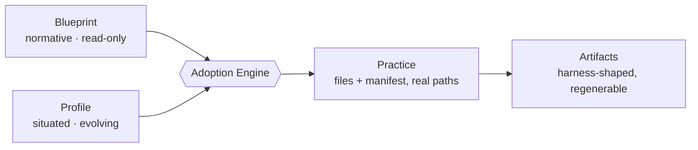

# Magentix

Magentix compiles a best-practice document and the actual, situated facts about a person or a
project into working agent configuration — and keeps telling you, mechanically, when that
configuration has gone stale.

## The problem

Most agent setups start the same way: someone copies a `CLAUDE.md`, a skills directory, a hooks
file — from a blog post, a previous project, a colleague's dotfiles — and the copy becomes the
setup. From there it dies one of two recognizable ways:

- **The template ships unfilled.** The placeholders stay placeholders, and six months later the
  file is loaded into every session while telling the agent nothing.
- **The interpretation drifts.** Someone improvises an adaptation, never records why, and within a
  month nobody can tell which parts were deliberate and which were accidents.

"Just write a good `CLAUDE.md`" survives neither failure. A good file, at the moment it's written,
says nothing about whether it stays good — nothing checks whether the placeholders got filled in,
and nothing checks whether an improvisation still matches what anyone actually decided. Both
failures are invisible from the outside: the file is still there, still committed, still loaded —
right up until it costs someone real time.

## The idea

Magentix treats "how we work with agents" as something compiled from two inputs that evolve on
separate clocks, rather than a document written once:

- A **Blueprint** — a normative best-practice document: general, portable, and read but never
  written by the loop that adopts it.
- A **Profile** — the situated, evolving truth about one person or one project: specific, partial,
  and owned by whoever it describes.

An **Engine** (the Adoption Loop) compiles a blueprint against a profile into a **Practice**: real
files, at real paths, with a manifest recording why each one is the way it is and a review trigger
that catches drift. The practice is the only one of the four that's disposable — both inputs can
change independently, and the practice regenerates instead of either input being re-derived.



Full account, including precedence rules and the four roles' invariants: [`docs/architecture.md`](docs/architecture.md).

## Install

Magentix ships as a single Claude Code plugin — the whole repository is the plugin
(`.claude-plugin/plugin.json` sits at the root):

```
/plugin marketplace add skylerbubier/magentix
/plugin install magentix@magentix-marketplace
```

The marketplace is named `magentix-marketplace`; the plugin inside it is named `magentix` (see
[`.claude-plugin/marketplace.json`](.claude-plugin/marketplace.json)).

You do not have to install anything to get value here. Every blueprint, profile schema, and
architecture document in this repository is plain Markdown, meant to be read directly — clone it or
browse it on GitHub and use it as a documentation library. Installing the plugin only matters once
you want the skills to run for you.

## Start here

The first thing to run is [`/magentix:assess-agentic-setup`](skills/assess-agentic-setup/SKILL.md).
It inventories whatever you already have — a user-criteria collection, a project profile, adopted
practices, existing `CLAUDE.md` / `.claude/` files — classifies each finding honestly as
**enforced**, **asserted**, or **missing**, and ends with one recommended next skill (or a short
ordered list, when more than one gap is real) instead of a menu of ten options.

## What's in the box

| Skill | Produces | Reach for it when |
|---|---|---|
| [`assess-agentic-setup`](skills/assess-agentic-setup/SKILL.md) | One written assessment — enforced / asserted / missing per finding — plus a routed next skill | Starting out, or auditing what's already set up |
| [`elicit-user-profile`](skills/elicit-user-profile/SKILL.md) | A user-criteria collection (`UC-NNNN` files + `INDEX.yaml`) | Building or maintaining what's durably true about one person |
| [`survey-project-profile`](skills/survey-project-profile/SKILL.md) | A project fact collection (`PF-NNNN` files, `INDEX.yaml`, `practices.yaml`) | Recording a repo's CI, branch protection, CODEOWNERS, and conventions before asking anyone anything |
| [`inventory-capabilities`](skills/inventory-capabilities/SKILL.md) | `capability`-category facts plus a gap list | Deciding whether a control actually fails closed or is only a convention |
| [`bind-harness`](skills/bind-harness/SKILL.md) | A filled or migrated `harness/bindings.yaml` | Mapping a profile's abstract slots onto one concrete tool, or migrating tools |
| [`capture-correction`](skills/capture-correction/SKILL.md) | A working-log entry, or a promoted `UC-NNNN` criterion | The person corrects the agent and the correction might be durable |
| [`adopt-practice`](skills/adopt-practice/SKILL.md) | A working practice — materialized files, `practice-manifest.json`, `adoption-record.md` | Compiling a blueprint against a profile end to end, or re-entering an adopted practice after drift |
| [`check-practice-drift`](skills/check-practice-drift/SKILL.md) | A drift report against one `practice-manifest.json` | Checking whether a live practice needs to re-enter the adoption loop |
| [`setup-agent-context`](skills/setup-agent-context/SKILL.md) | The four filled Agent Context Kit documents | Instantiating or maintaining the preference layer without a full gated adoption run |
| [`author-spec-tree`](skills/author-spec-tree/SKILL.md) | Docs-as-code spec artifacts, by tier | Building or amending an AI-SDLC specification plane |

Two subagents back these skills, both strictly read-only: [`profile-surveyor`](agents/profile-surveyor.md)
gathers raw evidence for a project profile survey — CI, CODEOWNERS, dependency manifests, existing
agent tooling — and writes nothing; [`spec-validator`](agents/spec-validator.md) runs the
spec-validation assertions against a `practice-spec.md` and reports pass/fail with evidence,
never editing the spec itself.

## Repository map

| Directory | Purpose | Entry document |
|---|---|---|
| [`blueprints/`](blueprints/README.md) | Blueprint — the best practices on offer | [`blueprints/README.md`](blueprints/README.md) |
| [`profiles/`](profiles/README.md) | Profile — situated fact, personal and project | [`profiles/README.md`](profiles/README.md) |
| [`adoption/`](adoption/README.md) | Engine — the loop that compiles one against the other | [`adoption/README.md`](adoption/README.md) |
| [`skills/`](skills/) | Artifacts — the ten skills an agent actually invokes | [`skills/assess-agentic-setup/SKILL.md`](skills/assess-agentic-setup/SKILL.md) |
| [`agents/`](agents/) | Two read-only subagents the skills call on | [`agents/profile-surveyor.md`](agents/profile-surveyor.md) |
| [`templates/harness/`](templates/harness/README.md) | Inert per-tool template packs, copied out and adapted | [`templates/harness/README.md`](templates/harness/README.md) |
| [`scripts/`](scripts/Test-PracticeDrift.ps1) | The one executable check this repo actually ships | [`scripts/Test-PracticeDrift.ps1`](scripts/Test-PracticeDrift.ps1) |
| [`docs/`](docs/README.md) | Architecture, glossary, diagrams | [`docs/README.md`](docs/README.md) |
| [`.claude-plugin/`](.claude-plugin/plugin.json) | Plugin and marketplace manifests | [`.claude-plugin/plugin.json`](.claude-plugin/plugin.json) |

## Design commitments

- Blueprints name no tool — every fact about a specific agent tool is quarantined to one
  harness-binding file per profile ([`blueprints/README.md`](blueprints/README.md)).
- Asserted and enforced are never conflated — an entry claiming enforcement must name a mechanism
  that fails closed, or it is demoted and the demotion recorded ([`adoption/01-loop.md`](adoption/01-loop.md)).
- Every enforced control is verified by violating it, not by reading its configuration
  ([`adoption/checks/materialization-check.md`](adoption/checks/materialization-check.md)).
- Drift is detected mechanically — hash comparison, review dates, deferral triggers — never by
  diligence ([`adoption/checks/drift-check.md`](adoption/checks/drift-check.md)).
- A profile is built from real corrections and observations, never a first-sitting interview
  ([`profiles/README.md`](profiles/README.md)).
- A path belongs to exactly one practice — a collision is a human decision, never a merge
  ([`docs/architecture.md`](docs/architecture.md)).

## Status and scope

This is version 0.1.0.

Most of this repository is documentation: blueprints, profile schemas, the adoption loop's own
stage-by-stage reference, and the skills that walk an agent through following them. That
documentation is thorough and internally cross-checked, but it is text an agent reads and follows
because it was asked to — the corpus's own word for that is **asserted**, and most of what ships
here is asserted, deliberately.

The AI-SDLC blueprint specifies several scripts — freeze, spec-diff generation, blocker triage,
promotion — as scripts rather than model work, on purpose: "every hop between planes is a script,
not a model." **None of those scripts are implemented in this repository.** Building them, for
whichever pipeline actually runs your delivery, is left to whoever adopts that blueprint.

The one executable artifact this repository ships is [`scripts/Test-PracticeDrift.ps1`](scripts/Test-PracticeDrift.ps1),
a PowerShell script implementing [`adoption/checks/drift-check.md`](adoption/checks/drift-check.md).
Everything else that looks like automation — the hooks and settings shown under
`templates/harness/` — is example material, never wired into this repository's own configuration.

## Contributing

See [`CONTRIBUTING.md`](CONTRIBUTING.md) for which of the four layers a change belongs in before
you open a PR.

## License

[MIT](LICENSE).
