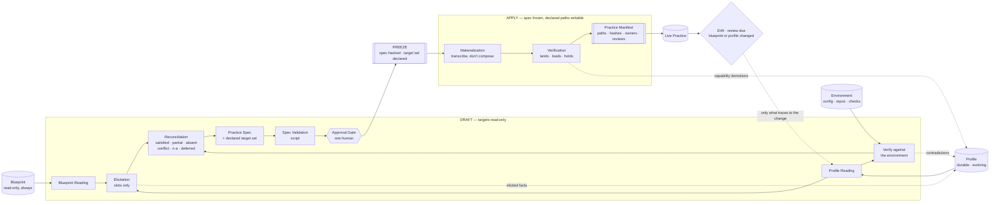

*[Magentix](../README.md) › Adoption engine*

# The Adoption Engine

**In this section:**

- [01-loop.md](01-loop.md) — the stage-by-stage reference: what each stage owns, reads, writes, and enforces.
- [02-blueprint-contract.md](02-blueprint-contract.md) — how the loop reads any best-practice blueprint, in the blueprint's own terms.
- [03-elicitation.md](03-elicitation.md) — how the loop gets what only a human knows, without asking for what it could have read.
- [04-materialization.md](04-materialization.md) — what happens after the gate, and what keeps a practice from rotting.
- [05-profile-contract.md](05-profile-contract.md) — how the loop reads any profile collection describing what is actually true.
- [checks/](checks/) — the mechanical checks: spec validation, materialization verification, drift detection.
- [templates/](templates/) — the fill-in forms each stage writes into: readings, spec, manifest, and records.
- [_kit/INSTRUCTIONS.md](_kit/INSTRUCTIONS.md) — the ten-step procedure an agent actually executes.

**Companion documents:** [01-loop.md](01-loop.md) (the stages) · [02-blueprint-contract.md](02-blueprint-contract.md) (how any blueprint is read) · [03-elicitation.md](03-elicitation.md) (getting what only a human knows) · [04-materialization.md](04-materialization.md) (writing it and keeping it) · [05-profile-contract.md](05-profile-contract.md) (how any profile is read) · [_kit/INSTRUCTIONS.md](_kit/INSTRUCTIONS.md) (what an agent actually executes)

**Diagrams:** [agentic-ecosystem.excalidraw](../docs/diagrams/agentic-ecosystem.excalidraw) (the four roles and how they compose) · [adoption-loop.excalidraw](../docs/diagrams/adoption-loop.excalidraw) (the loop in detail)

---

## Where this sits

Four roles, each evolving on its own clock:

| Role | What it is | Owned by | Changes when |
|---|---|---|---|
| **Blueprint** | A best practice: how some kind of work should be done | Its author | Agent capability advances, or the practice improves |
| **Profile** | The situated truth: what is actually the case for a person or a project | The adopter | The person or the project changes |
| **Engine** | This loop — compiles a blueprint against a profile | — | Rarely |
| **Artifacts** | Generated agent instructions, preferences, styles, checks | Nobody — regenerable | Either input changes |

Blueprints are normative and general. Profiles are descriptive and specific. Artifacts are disposable: they can always be rebuilt, which is what makes it safe for a blueprint to be revised.

The property that matters is that **both inputs evolve independently.** A revised blueprint re-renders artifacts and asks nobody anything. A changed profile re-renders artifacts and re-reads no blueprint. Neither ever requires re-deriving the other — and that only works because they are separate collections with separate formats and separate owners.

Two pairings are the common cases, and both fall out of scope matching rather than any hardcoding:

- an interaction-shaped blueprint × a **user profile** → user-scoped artifacts: personal instructions, response defaults, preference config
- a delivery-shaped blueprint × a **project profile** → project-scoped artifacts: project instructions, hooks, checks, spec scaffolding

Neither pairing is built into the engine. A blueprint's elements declare who authors them; a profile declares whose truth it holds; the match is derived. Any further blueprint — a review standard, an incident routine, a research practice — composes the same way.

## What this is

An agentic system with one job: take a best-practice blueprint written by somebody else, take the actual situation of one person or one team, and produce a working instance of that practice at real paths — then keep it working.

It is the layer between *"here is how this should be done"* and *"here is how we now do it."* That gap is where most best practices die. They die two ways, and both are recognizable on sight:

- **The template ships unfilled.** Somebody copies the blueprint's files, the placeholders stay placeholders, and six months later the file is loaded into every session while telling the agent nothing.
- **The interpretation drifts.** Somebody improvises an adaptation, never records why, and within a month nobody can tell which parts were deliberate and which were accidents.

The Adoption Loop exists to make both of those mechanically detectable rather than matters of diligence.

## Two inputs, one output

| | What it is | Who owns it | Mutability here |
|---|---|---|---|
| **Blueprint** | Documents proposing how some kind of work should be done | Its author, elsewhere | **Read-only, always** |
| **Profile** | The durable, evolving collection of what is actually true for this person or project | The adopter | Read freely; written only through add / confirm / supersede / retire |
| **Practice** | Files, configs, and checks that exist at real paths, plus the record of why each is the way it is | The adopter | The output |

Alongside the profile there is the **environment** — what can be read off disk right now. That is not a third input; it is how profile facts get verified, and how the profile finds out it has drifted.

The blueprint is normative and general. The profile is descriptive and specific, and only *partly* observable — some of it can be read, the rest lives in somebody's head. The practice is what you get when those two are compiled deliberately instead of interpreted by improvisation.

---

## The three invariants

Everything else in this design follows from these.

### 1. The blueprint is read, never written

The loop consumes a blueprint in place, as normative input, and produces nothing inside it. When an element proves awkward to instantiate, the agent records the conflict and escalates it — it does not soften the blueprint to match what it managed to build.

This is the same failure the source practices guard against one level down, and it appears here for the same reason: amending the requirement is genuinely the cheapest path available to an agent that is stuck. Removing that path is a configuration choice, not a supervision problem.

It has a second payoff. Because a blueprint is never modified and never required to declare anything about itself, the loop runs against blueprints whose authors will never know it ran — including every blueprint written before this system existed.

### 2. Drafting is wide, materialization is narrow

While the spec of the proposed practice is being drafted, the target locations are read-only. Once the spec is approved it freezes, and the target locations become writable — at the declared paths and nowhere else. There is no window in which both are moving.

Drafting is where the agent should have wide latitude: rewrite the proposed practice freely, restructure it, throw a draft away. That freedom is only safe because nothing it writes lands anywhere real. After the gate the opposite discipline applies — every write traces to an approved spec entry, and a write with no entry is a defect, not initiative.

### 3. Asserted and enforced are never conflated

Every element of a practice is one of two things:

- **Asserted** — a document an agent or a person is *asked* to honor. Nothing checks it. This is the right shape for preference, context, and judgment, none of which have a mechanical test.
- **Enforced** — something that **fails closed** when violated. A hook, a required approval, a pipeline check, a schema validation.

An element claiming to be enforced must name the mechanism that fails closed. If it cannot name one, it is demoted to asserted and the spec records the demotion. A practice that believes it holds a control it does not hold is worse than one that knows it holds none, because the belief is exactly what stops anyone from building the real thing.

> **Corollary, stated once here and repeated where it bites:** nothing this loop produces can relax a control that already exists in the target environment. A generated document may be *more* conservative than an enforced control. It may never be less. When a spec entry and an existing control disagree, the loop stops and says so rather than routing around either one.

---

## Working rules

Two rules that are not invariants but decide most of the hard calls.

**One home per fact.** Before generating anything, reconcile against what the situation already has. If a fact is already stated by a repo's conventions, by a check's configuration, or by an existing document, the output points at it rather than restating it. Two documents stating the same fact are a future contradiction, because one of them will be updated and the other will not.

**Authorship determines location.** Every element carries an author — this person, this team, an agent, or a script. An element authored by one person never materializes into a location the whole team inherits, however convenient that location is. This is the rule that keeps a personal preference from silently becoming something a colleague is bound by.

Because profiles mark each harness slot `personal` or `shared`, this is mechanical rather than a matter of care: spec validation asserts that no individually-authored entry targets a shared slot.

**A path belongs to one practice.** A project commonly runs several practices at once — a delivery pipeline, a review standard, an incident routine — each generating artifacts into the same repository. Two practices writing one file will overwrite each other, and the second one's regeneration silently destroys the first one's output. Ownership is recorded, collisions are detected, and resolving one is a person's decision about which practice owns what, never a merge.

---

## Mostly agent-agnostic

Only two things in this ecosystem ever know which agent tooling is in use:

1. **The harness binding** — one bounded section inside each profile, naming the tool, its slots, their scope, and what it can actually enforce.
2. **The generated artifacts** — necessarily harness-shaped, because they are files a specific tool reads.

Everything else is portable: blueprints, profile facts, this loop, and every check it runs. No blueprint element names a tool. No profile fact names a config path. No assertion in spec validation depends on a product.

The practical test is migration. Changing agent tooling should be: edit one profile section, regenerate, verify the new artifacts load, retire the old ones. **No blueprint is re-read and no fact is re-elicited.** If a migration requires touching either, something tool-specific leaked upstream, and that is the bug.

"Mostly" is honest rather than hedging. The artifacts layer cannot be agnostic — its whole job is to be the shape a particular tool reads. Confining that to the last step, plus one declared section, is the most agnosticism available.

---

## The flow



Note the three dotted edges into the profile. Elicited facts, contradictions found during verification, and capability demotions all land in the collection rather than in this run's notes — which is what makes the next adoption cheap.

The first half is a conversation. The second half is a transcription. The gate is the only place a human is required, and what they review is the spec — a diff against reality — not a summary of it.

---

## What is judged and what is mechanical

Being explicit about this is the point of the design, and it is the same split both source practices make internally.

| Mechanical (fails closed, costs no judgment) | Judged (agent or human forming an opinion) |
|---|---|
| Every spec entry traces to a blueprint element or a recorded decision | Whether the spec expresses the practice the adopter actually wants |
| No entry claims enforcement without a named failing-closed mechanism | Which blueprint elements matter most here |
| No unfilled placeholder survives into an approved spec | What an elicited answer actually means |
| No fact appears in two entries | Whether a conflict is worth resolving or living with |
| No write outside the declared target set | How to adapt an element that does not fit cleanly |
| Authorship-to-location containment | Whether a drifted file is an improvement or a mistake |
| Manifest hashing and drift detection | Whether the practice is working |

The left column is what makes the right column trustworthy. Nothing in it requires an agent to choose to comply.

---

## What this is not

- **Not a blueprint.** It holds no opinion about how anyone should work. Every opinion in an output traces to the blueprint it was given or to a decision the adopter recorded.
- **Not an enforcement layer.** It can *generate* enforcement where a blueprint calls for it and the environment supports it, but the loop itself enforces nothing beyond its own gate.
- **Not a replacement for a blueprint's own gates.** If a blueprint defines approvals, the generated practice carries them forward. This loop's gate covers adopting the practice, not operating it.
- **Not a one-shot generator.** A practice created and never revisited is the failure mode this design is built around. Materialization without a manifest and a review trigger is half the job.

## Precedence

When sources disagree, in order:

1. **Enforced controls in the target environment.** A denied tool call, a required approval, an org policy. These sit above everything, including an instruction in the conversation, and the loop stops at them rather than routing around either side.
2. **The approved spec.** After the gate, the spec is the authority on what gets written.
3. **Recorded decisions from elicitation.** Where the adopter deliberately diverged from the blueprint, with a reason.
4. **The blueprint.** The default for anything the three above do not settle.
5. **Agent judgment.** Only for what none of the above settles, and it says so when it does.

An explicit instruction in the conversation overrides 2 through 5. It does not override 1.

---

## Where the loop's own files live

The loop keeps a workspace, separate from both the blueprint and the target locations:

```
adoption/{practice-id}/
  blueprint-reading.yaml     # derived from the blueprint; the blueprint stays untouched
  profile-reading.yaml       # derived from the profile; normalized confidence + freshness
  verification-notes.md      # profile facts checked against the environment
  practice-spec.md           # the reviewable object — frozen at the gate
  practice-manifest.json     # materialized paths, hashes, owners, review dates
  adoption-record.md         # what was instantiated, what was deferred, and why
```

This workspace is not the practice, and it is **not where facts live**. It holds two derived readings and one run's record. Every fact elicited, corrected, or verified during a run belongs to the profile collection, which outlives both the run and the blueprint that prompted it.

That division is what makes the second run cheap. A workspace holding facts means the next adoption asks for them again — which is the failure the profile contract exists to prevent.

Three placement notes that are easy to get wrong:

- **The workspace never lives inside the blueprint.** That would violate invariant 1 on the first write.
- **The workspace never holds the profile.** A copy of a fact here is a fact that will not be updated.
- **The workspace is agent-writable at all times.** Writing it is never a change to the practice, never something a reviewer looks at, and never subject to the declared target set. A loop whose own note-taking can be denied produces a run that cannot hand off.

---

## Known limits

- **A bad blueprint produces a bad practice, faithfully.** This loop guarantees the practice matches the blueprint and the profile. It guarantees nothing about the blueprint being right. Conflict counts during reconciliation are the early warning.
- **Profile quality is the ceiling.** Everything downstream is only as good as the facts available. A thin or stale profile produces a practice built on guesses — which the loop will say, but cannot fix.
- **Not every element is instantiable.** Some are cultural, or depend on tooling that does not exist here. Those are recorded as deferred with a revisit trigger — not quietly dropped, and not faked with a document that pretends to be a control.
- **The gate can become the constraint.** The named approver may not be the person running the loop, and for facts whose authority sits outside the adopter, may not be reachable from it at all. Count approvals, not spec drafts.
- **Several practices per project need path arbitration.** Ownership is recorded and collisions are detected, but deciding which practice owns a contended file is a judgment nobody can automate. The usual contention point is a repository's main agent-instruction file, because every practice has something to say there.
- **Regeneration ordering is unmodeled beyond declared dependencies.** Rebuilding a practice that another one depends on can leave the dependent pointing at content that no longer exists. Declared order catches the common case, not every case.
- **No usage telemetry.** The loop can tell you a practice exists and has not drifted. It cannot tell you anyone is using it. That signal has to come from the practice's own instrumentation, which is a blueprint's concern rather than this one's.
