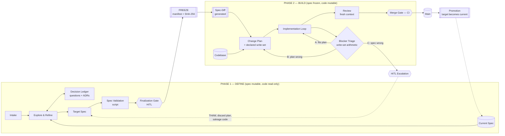

*[Magentix](../../README.md) › [Blueprints](../README.md) › [AI-SDLC](README.md) › Overview*

# Two-Phase Spec-Driven AI-SDLC

**Companion documents:** [ai-sdlc-flow.excalidraw](../../docs/diagrams/ai-sdlc-flow.excalidraw) (the diagram) · [subsystems.md](subsystems.md) (what each box does) · [spec-recipe.md](spec-recipe.md) (what goes in the spec tree)

---

## The two invariants

Everything else in this design follows from two rules.

**1. The mutability inversion.**
While intent is uncertain, the specification is mutable and the source code is read-only. The moment intent is settled, that inverts: the specification freezes and the source code becomes mutable. There is no window in which both are editable.

This is the answer to the failure mode where an agent, finding the implementation harder than expected, quietly amends the requirement to match what it managed to build. Not because the agent is adversarial, but because moving the goalposts is genuinely the cheapest path available to it. Removing that path is a configuration change, not a supervision problem.

**2. Every hop between planes is a script, not a model.**
The chain from intent to code is a compilation pipeline whose intermediate representation is documents. A real compiler is trustworthy because its IR is typed, its passes are deterministic, and a lowering that breaks the next pass fails loudly at build time. Prose IRs have none of those properties: the same input lowers differently on different days, and a plan that silently drops a requirement compiles fine all the way to a green CI run.

Machine-native contracts give you the typed IR. Script-generated diffs give you a deterministic pass. Diff-entry traceability gives you the type error. Those three things convert "the artifact chain is a good idea" into "the artifact chain has checks."

---

## The flow

### Phase 1 — Define

A signal of any kind becomes a committed `change-request.md` with an author and a timestamp, before anything else happens. That record exists so the loop has a countable intake and a survival rate; a conversation that was never committed cannot be measured or triaged.

The agent then interviews the human and translates intent into **edits to the specification**, not into prose about the intent. "Add a field to the customer page" becomes a JSON Schema edit, an OpenAPI edit, and a new Gherkin scenario. Ambiguities land in `open-questions.md`; anything whose answer will outlive this change becomes an ADR.

This is deliberately a conversation with wide latitude. The agent can and should freely rewrite the target spec, because that is the point of the phase. What it cannot do is touch source code — a hook denies it.

The phase ends with a script validating the target spec against every grammar and compatibility rule available, and exactly one human gate. The human reviews the target spec itself, not a summary of it. That is the whole substitution this design makes: the human stops reading diffs of code and starts reading diffs of contracts, which are smaller, denser, and partly machine-checked before they arrive.

### The freeze

A script snapshots the current spec, writes `change-manifest.json` containing a SHA-256 of every specification artifact in play, and flips the phase flag. The manifest is the single source of truth for what is mutable; hooks, scripts, and CI all read it.

Then a second script generates the **spec-diff** using format-aware diff tools — OpenAPI diff, schema-registry compatibility, GraphQL inspector, Gherkin scenario set-diff. Every semantic change gets a stable `diff-entry-id` and a classification.

This artifact is generated and never authored. If a model writes the diff, the determinism this whole design rests on is gone.

One clarification about what the manifest governs, because getting it wrong makes the design unusable in practice. The frozen set and the declared write-set cover **project content** — specification artifacts and source. They do not cover the agent's own working state: the notes it keeps for continuity, its scratch files, its telemetry output. That material lives on paths the write rules exempt, and writing it is never a change to the project, never a diff entry, and never something a reviewer looks at. A design that lets a path predicate deny the agent's own note-taking produces an agent that cannot hand off work, which is the opposite of what a phase boundary is for.

### Phase 2 — Build

Planning reads the **diff** as the work list, with current and target as reference. Two properties make the plan checkable: every task traces to at least one `diff-entry-id`, and the plan declares the write-set of source paths it intends to touch. A script then asserts that every diff entry is traced by some task — which is the "type error" for a plan that quietly dropped a requirement — and that the declared write-set does not intersect the frozen set.

The implementation loop runs with its own verification: the Gherkin from the target spec is already the acceptance test, so the agent has a way to check its own work and iterate before a human sees anything.

### Blocker triage — the mechanism that replaces stage gates

When implementation hits something unplanned, the question is how much has to be redone. The design answers that with set arithmetic rather than judgment.

| Class | Test | Response | Cost |
|---|---|---|---|
| **A** | write-set fits the declared plan | continue in loop | free |
| **B** | outside the plan, but no frozen artifact affected | **re-plan only** — same frozen set, branch and completed work survive | one planning pass |
| **C** | a frozen artifact must change | **thaw** — human decides, spec is amended, everything downstream regenerates | full Phase-2 restart |

The classifier is the hook, not a model. When the agent attempts a write, the path either intersects the frozen set or it does not; that boolean *is* the classification, and the denial event is what raises it. Nothing self-reports.

Class B matters more than it looks. Most surprises during implementation are planning errors, not contract errors, and a design that treats every surprise as a full restart will be abandoned within a month. Making the cheap case cheap is what keeps the expensive case credible.

**On the Class C question — does everything get discarded?** The plan does. The code mostly does not.

On thaw, the spec is amended and a *new* diff is generated at revision 2. A script then compares the two diffs:

- diff entries **unchanged** → the tasks tracing to them are still valid, and their commits survive
- entries **added** → new tasks
- entries **modified or removed** → tasks tracing to them are invalidated, and those commits are reverted

So the salvage is mechanical, and it works only because every task carried a `traces:` field from the start. One design decision at planning time buys both the plan validation and the restart salvage. If the invalidated fraction crosses a threshold, the script recommends abandoning the branch and a human confirms — but that is a cost judgment, not a correctness one.

### Phase 3 — Promote

On merge, a script copies the target spec over the shared tree so target becomes current, archives the diff and plan with the change, and unfreezes.

This edge is easy to omit and expensive to omit. Without it the next change plans against a stale baseline and every subsequent diff is subtly wrong.

---

## What is deterministic and what is judged

Being explicit about this is the point of the design. Anything in the left column can fail closed without a person; anything in the right column is a model or a human forming an opinion.

| Deterministic (script / hook / CI) | Judged (model or human) |
|---|---|
| Spec grammar and compatibility checks | Whether the target spec expresses the real intent |
| Diff generation | What the change should be |
| Freeze enforcement and hash verification | Whether a Class C amendment is worth making |
| Plan ↔ diff coverage | The implementation approach |
| Write-set containment | Code quality and review findings |
| Blocker classification | How to resolve a blocker |
| Diff-of-diffs salvage | Whether to abandon a branch |
| ADR applicability and precedence | What an ADR should say |
| Merge gate | Risk acceptance on critical paths |

Three structural notes. First, **hooks can only deny.** Silence never approves, and no hook can auto-approve its way out of a review backlog. That asymmetry is correct for a governance layer and it means hooks are never sufficient on their own.

Second, **hooks bind tool calls, not writes.** A file written by a shell redirect is not an edit-tool call and will route around a path predicate. That is precisely why the authoritative freeze check is CI re-hashing the frozen set on every push, with the hook serving as fast local feedback. Hooks advise; CI decides.

Third, **no guidance layer sits above the left column.** Every agent runs with instruction files, preference documents, and personal or team configuration steering how it behaves — that layer is real and useful, and it is entirely in the right column. It can make the agent more cautious than this design requires. It cannot make it less: a document asking for autonomy does not widen a write-set, and an instruction in the conversation to proceed does not dissolve a gate. When guidance and a control disagree, the correct behavior is to stop at the control and say what stopped it. Anything that could relax a control by being written down was never a control.

---

## Why this shape

Four criticisms are commonly levelled at artifact-chain SDLCs. This design's answer to each:

**"It recreates waterfall — the human bottleneck just moves to reading documents."**
The human reads contracts, schemas, and Gherkin rather than narrative documents. Those are denser, are the artifacts engineers would review anyway, and arrive already validated by a script. There is exactly one human gate in the definition phase and one risk-tiered gate at merge.

**"Line-by-line human review can't keep up with agent output."**
Review is split three ways: mechanical conformance to CI, defect and diff-conformance review to a fresh-context agent, and risk-tiered judgment to a named human. The risk tier is derived from the diff itself — a change touching an auth contract declares its own blast radius, so tiering needs no separate classification step.

**"Advisory controls can't hold policies that must always hold."**
Nothing in this design relies on an agent choosing to comply. Freeze, write-set containment, diff coverage, and ADR precedence are all scripts. The agent-facing instructions are guidance; the scripts are the control. That split is what lets the guidance layer be tuned freely — verbosity, autonomy, how much the agent asks before acting — without any of it touching what is enforceable.

**"The whole thing assumes telemetry nobody has."**
The design emits its own. Diff size is a blast-radius proxy. Class-B and Class-C blocker rates measure whether planning or definition is the weak stage. Diff-entry coverage measures plan fidelity. All of it falls out of artifacts the process already produces.

---

## What to measure

| Signal | Reads as |
|---|---|
| Class **B** rate | Planning quality. High B means the planner lacks codebase context. |
| Class **C** rate | Definition quality. High C means the spec is being written without technical grounding — pull an engineer into Phase 1. |
| Diff-entry coverage at merge | Plan fidelity. Anything below 100% is a dropped requirement. |
| Phase 1 vs Phase 2 wall-clock | Where the bottleneck actually sits. Expect it to move once this is running. |
| Token cost by phase and by skill | Where spend concentrates. Phase 1 should dominate; if Phase 2 does, the diff isn't scoping the work. |
| Frozen-set violations caught by CI but not by hooks | Hook coverage gaps, especially shell-write routes. |
| Human gate wait time | Whether the single Phase-1 gate is staffed. |

Baseline all of these before changing the process, or you will not be able to tell an improvement from a bottleneck that simply relocated.

---

## Adoption order

Do not build this in diagram order. Build it in dependency order.

1. **The spec tree** — start with the six-artifact minimum from the recipe. Nothing else works without something diffable.
2. **Spec validation** — grammar and compatibility checks in CI. Immediate value even with no other change.
3. **Diff generation** — the moment this is a script, the design's central claim is real.
4. **Freeze + manifest + hooks** — the mutability inversion. This is where behavior actually changes.
5. **Plan traceability + plan validation** — enables everything downstream, including salvage.
6. **Blocker triage** — needs 4 and 5 in place first.
7. **Promotion** — needed before the second change, so do not defer it past the pilot.
8. **Review split, telemetry, evals** — refinement.

Steps 1–4 are a working system on their own. Piloting on one service with one team for three or four changes will surface more than further design will.

---

## Known limits

- **Not everything is diffable.** UX judgment, architectural taste, and "is this the right product decision" have no grammar. Those stay in the conversation plane and at the human gate, which is where they belong. This design makes the mechanical parts mechanical; it does not pretend the rest away.
- **Bad specs still produce bad software, faster.** The freeze guarantees the code matches the spec. It guarantees nothing about the spec being right. The Class C rate is your early warning.
- **The intake can outrun the gate.** If automated sources ever feed intake, a single human gate becomes the constraint. Count acceptances rather than creations.
- **Cross-change concurrency is out of scope here.** Two changes freezing overlapping spec artifacts will conflict at promotion. The simplest workable rule is that a spec artifact may be in one active change's frozen set at a time, enforced by the manifest — but a team running many parallel changes will need more than that.
- **No maintain stage.** This design stops at promotion. Production monitoring writing findings back into intake closes the loop and is a deliberate next increment, not part of the core.
