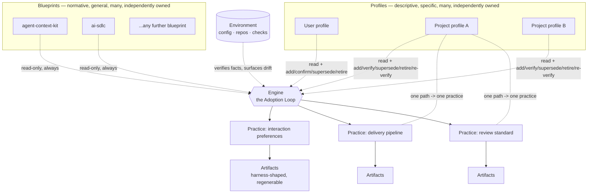

*[Magentix](../README.md) › Architecture*

# Architecture

The conceptual spine of this repository: how a best practice written by someone else becomes a
working instance of that practice for one person or one team, and how it keeps working after the
person writing it down has moved on.

---

## 1 · The problem

A best practice dies in two recognizable ways, and the whole system exists to make both of them
mechanically detectable rather than a matter of diligence:

- **The template ships unfilled.** Somebody copies the blueprint's files, the placeholders stay
  placeholders, and six months later the file is loaded into every session while telling the agent
  nothing.
- **The interpretation drifts.** Somebody improvises an adaptation, never records why, and within a
  month nobody can tell which parts were deliberate and which were accidents.

*(Source: [`adoption/README.md`](../adoption/README.md), "What this is.")*

---

## 2 · The four roles

Four things, each evolving on its own clock. See [`diagrams/agentic-ecosystem.excalidraw`](diagrams/agentic-ecosystem.excalidraw)
for the picture.

### Blueprint

**What it is:** documents proposing how some kind of work should be done — normative and general.
**Owned by:** its author, elsewhere; the loop never knows it ran. **Changes when:** agent capability
advances, or the practice improves. **May contain:** elements, invariants, an out-of-scope list, an
adoption order, minimum-viable subset, and slots the adopter must fill — expressed in the blueprint's
own vocabulary and detail. **May not contain:** anything about a specific person or project, or a
tool name. **Invariant:** the blueprint is read, never written — it is required to declare nothing,
carry no front-matter, and adopt no schema, which is what lets the loop run against blueprints
written before it existed.
*(Source: [`adoption/README.md`](../adoption/README.md); [`adoption/02-blueprint-contract.md`](../adoption/02-blueprint-contract.md).)*

### Profile

**What it is:** the durable, evolving collection of what is actually true for one person or one
project — descriptive and specific, and only partly observable. **Owned by:** the adopter.
**Changes when:** the person or the project changes. **May contain:** facts (or criteria), each with
its own date, source, rationale, and confidence — plus, at project scope, a capability inventory and
a gap list. **May not contain:** a blueprint's normative content, generated instructions, or a tool
name outside its harness binding. **Invariant:** read freely; written only through the collection's
own moves — user profiles: add, confirm, supersede, retire; project profiles: add, verify,
supersede, retire, plus a fifth, re-verify.
*(Source: [`profiles/user/README.md`](../profiles/user/README.md); [`profiles/project/README.md`](../profiles/project/README.md); [`adoption/05-profile-contract.md`](../adoption/05-profile-contract.md).)*

### Engine

**What it is:** the Adoption Loop — compiles a blueprint against a profile. **Owned by:** nobody in
particular; it is the process itself. **Changes when:** rarely. **May contain:** the stage
sequence, its own workspace per practice, and the checks that gate each stage. **May not contain:**
an opinion about how anyone should work — every opinion in its output traces to the blueprint it was
given or a decision the adopter recorded. **Invariant:** drafting is wide, materialization is narrow
— target locations are read-only until a spec is approved and frozen, and writable only at the
declared paths afterward.
*(Source: [`adoption/README.md`](../adoption/README.md); [`adoption/01-loop.md`](../adoption/01-loop.md).)*

### Artifacts

**What it is:** generated agent instructions, preferences, styles, and checks. **Owned by:** nobody
— they are regenerable. **Changes when:** either input (blueprint or profile) changes. **May
contain:** whatever shape a specific tool reads — the one place tool-specificity is allowed to live.
**May not contain:** anything that is not traceable back to a blueprint element and a profile fact.
**Invariant:** asserted and enforced are never conflated — an artifact claiming enforcement must name
a mechanism that fails closed, or it is demoted and the demotion is recorded.
*(Source: [`adoption/README.md`](../adoption/README.md); [`adoption/01-loop.md`](../adoption/01-loop.md).)*

### Environment

Not a fifth role, and not a third input. The environment is what can be read off disk right now —
config, repos, checks. Its job is to verify profile facts before anyone is asked anything, and it is
how a profile finds out it has drifted. The environment is consulted, never owned, and never
written to by the loop.
*(Source: [`adoption/01-loop.md`](../adoption/01-loop.md), vocabulary table.)*

---

## 3 · How they compose

**Blueprint × Profile → Practice.** A practice is what you get when a blueprint (normative, general)
is compiled deliberately against a profile (descriptive, specific) instead of being interpreted by
improvisation. The practice is files, configs, and checks that exist at real paths, plus the record
of why each is the way it is — and it is the only one of the four things that is an *output* rather
than an input.

Both inputs evolve independently, and that independence is the property the whole design rests on. A
revised blueprint re-renders artifacts and asks nobody anything; a changed profile re-renders
artifacts and re-reads no blueprint. Neither ever requires re-deriving the other, because they are
separate collections with separate formats and separate owners.

That independence is also why the pairing is many-to-many rather than one-to-one. One blueprint —
an interaction-preference kit, a delivery pipeline, a review standard, an incident routine — can be
adopted by many profiles, each producing its own practice. One profile commonly adopts many
blueprints at once: a project's delivery pipeline, its review standard, and its incident routine can
all be live in the same repository simultaneously. Which profile a blueprint's elements draw from is
derived from scope matching (an element authored by `user` pairs with an individual profile; one
authored by `team` or `script` pairs with a shared profile), never hardcoded into the engine.

The one constraint that keeps many practices in one project from colliding: **a path belongs to
exactly one practice.** Two practices writing the same file will overwrite each other, and the
second one's regeneration silently destroys the first one's output — so ownership is recorded, and a
collision is a human decision, never a merge.
*(Source: [`adoption/README.md`](../adoption/README.md); [`profiles/project/02-collection.md`](../profiles/project/02-collection.md).)*

This is a different view from [`diagrams/adoption-loop.excalidraw`](diagrams/adoption-loop.excalidraw)
and the stage-flow diagram in [`adoption/README.md`](../adoption/README.md): that one shows the loop's
internal stages for a single practice; this one shows the many-to-many composition across blueprints,
profiles, and the practices they jointly produce.

---

## 4 · Invariants and working rules

Stated in their own words, because paraphrase is where they erode:

- **"The blueprint is read, never written."** The loop consumes a blueprint in place and produces
  nothing inside it. An awkward-to-instantiate element gets a recorded conflict and an escalation,
  never a softened blueprint — amending the requirement is the cheapest path available to a stuck
  agent, and removing that path is a configuration choice.
- **"Drafting is wide, materialization is narrow."** While a spec is being drafted, target locations
  are read-only, so the agent can rewrite freely because nothing lands anywhere real. Once the spec
  is approved and frozen, every write must trace to an approved entry — a write with no entry is a
  defect, not initiative.
- **"Asserted and enforced are never conflated."** An asserted element is a document someone is
  *asked* to honor; an enforced one fails closed when violated and must name the mechanism that does
  so. A practice that believes it holds a control it does not hold is worse than one that knows it
  holds none, because the belief is what stops anyone from building the real thing.
- **"One home per fact."** Before generating anything, reconcile against what already states the
  fact — a repo's conventions, a check's configuration, an existing document — and point at it rather
  than restate it. Two documents stating the same fact are a future contradiction, since only one of
  them will be updated.
- **"Authorship determines location."** Every element carries an author, and an element authored by
  one person never materializes into a location the whole team inherits, however convenient that
  location is. Profiles mark each harness slot `personal` or `shared`, which makes this mechanical:
  spec validation asserts that no individually-authored entry targets a shared slot.

*(Source: [`adoption/01-loop.md`](../adoption/01-loop.md), "The three invariants" and "Working rules.")*

---

## 5 · Precedence

When sources disagree, in this order:

1. **Enforced controls in the target environment** — a denied tool call, a required approval, an org
   policy.
2. **The approved spec** — after the gate, the authority on what gets written.
3. **Recorded decisions from elicitation** — where the adopter deliberately diverged from the
   blueprint, with a reason.
4. **The blueprint** — the default for anything the above do not settle.
5. **Agent judgment** — only for what none of the above settles, and it says so when it does.

An explicit instruction in the conversation overrides 2 through 5. It does not override 1. A
generated document — or a criterion, or a preference layer file — may be *more* conservative than an
enforced control; it may never be less, because nothing produced downstream of a blueprint or a
profile can widen what an enforced mechanism already restricts. Preference only ever narrows.
*(Source: [`adoption/01-loop.md`](../adoption/01-loop.md), "Precedence.")*

---

## 6 · Harness agnosticism

No blueprint element and no profile fact names a tool. That rule holds at both personal and project
scope, and it is absolute: a criterion or a fact that assumes a particular agent's file layout has
become tool-specific, and switching tools then means re-reading every one of them to find which
quietly assumed the old setup.

All tool-specific knowledge is quarantined into exactly one file per collection — the **harness
binding** — naming the tool, its slots, their scope (`personal` or `shared`), and what it can
actually enforce. The generated artifacts are the only other place tool-specificity is allowed,
because their whole job is to be the shape a particular tool reads.

The practical test is migration: add the new harness to the binding, regenerate, verify the new
artifacts load, retire the old ones. No blueprint is re-read and no fact is re-elicited. If a
migration requires touching either, something tool-specific leaked upstream, and that is the bug.
*(Source: [`adoption/README.md`](../adoption/README.md), "Mostly agent-agnostic"; [`profiles/user/03-harness-binding.md`](../profiles/user/03-harness-binding.md); [`profiles/project/04-harness-binding.md`](../profiles/project/04-harness-binding.md).)*

---

## 7 · What is deterministic and what is judged

Being explicit about this split is the point of the design, and both the adoption loop and the
AI-SDLC blueprint make it internally: "every hop between planes is a script, not a model."

| Mechanical (fails closed, costs no judgment) | Judged (agent or human forming an opinion) |
|---|---|
| Every spec entry traces to a blueprint element or a recorded decision | Whether the spec expresses the practice the adopter actually wants |
| No entry claims enforcement without a named failing-closed mechanism | Which blueprint elements matter most here |
| No unfilled placeholder survives into an approved spec | What an elicited answer actually means |
| No fact appears in two entries; no write outside the declared target set | Whether a conflict is worth resolving or living with |
| Manifest hashing and drift detection | Whether the practice is working |
| Spec grammar/compatibility checks, diff generation, freeze + hash verification, plan↔diff coverage, write-set containment, blocker classification (AI-SDLC) | Whether the target spec expresses real intent; the implementation approach; whether a Class C amendment is worth making |

*(Source: [`adoption/01-loop.md`](../adoption/01-loop.md), "What is judged and what is mechanical"; [`blueprints/ai-sdlc/overview.md`](../blueprints/ai-sdlc/overview.md), "What is deterministic and what is judged.")*

---

## 8 · Map of the repository

| Directory | Role | Entry document |
|---|---|---|
| `blueprints/` | **Blueprint** — the practices on offer | [`blueprints/agent-context-kit/README.md`](../blueprints/agent-context-kit/README.md) · [`blueprints/ai-sdlc/overview.md`](../blueprints/ai-sdlc/overview.md) |
| `profiles/` | **Profile** — the situated truth, per person and per project | [`profiles/user/README.md`](../profiles/user/README.md) · [`profiles/project/README.md`](../profiles/project/README.md) |
| `adoption/` | **Engine** — the loop that compiles one against the other | [`adoption/README.md`](../adoption/README.md) |
| `scripts/` | **Engine** — the mechanical half of maintenance (drift detection) | [`scripts/Test-PracticeDrift.ps1`](../scripts/Test-PracticeDrift.ps1) |
| `skills/` | **Artifacts** — harness-specific output for one agent tool (authored separately) | — |
| `docs/` | Cross-cutting — this document, the glossary, and the diagrams | [`glossary.md`](glossary.md) |

---

*Every claim above traces to a source document linked in place. Where this document summarizes, the
linked source carries the full detail and is the one to trust if the two ever disagree.*
